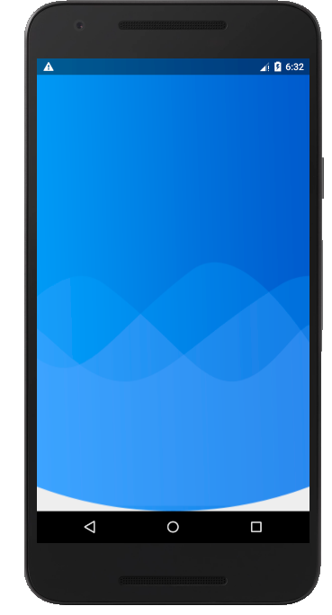
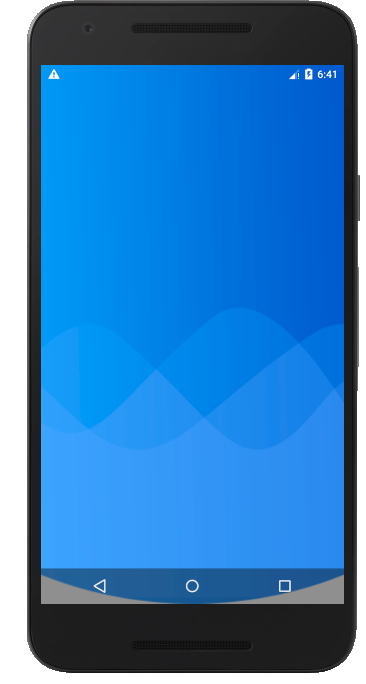
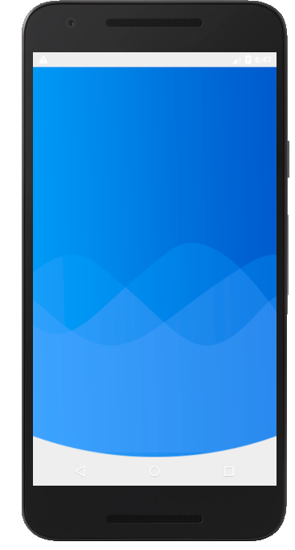

# 主题介绍

```gradle
    <style name="AppTheme.TranslucentStatus1" parent="Theme.AppCompat.Light.NoActionBar">
        <item name="colorPrimary">@color/colorPrimary</item>
        <item name="colorPrimaryDark">@color/colorPrimaryDark</item>
        <item name="colorAccent">@color/colorAccent</item>

        <!--4.4版本手机设置windowTranslucentStatus即可使状态栏全透明，但是5.0以上手机设置此项只会半透明-->
        <item name="android:windowTranslucentStatus">true</item>
    </style>
```




```gradle
    <style name="AppTheme.TranslucentStatus2" parent="Theme.AppCompat.Light.NoActionBar">
        <item name="colorPrimary">@color/colorPrimary</item>
        <item name="colorPrimaryDark">@color/colorPrimaryDark</item>
        <item name="colorAccent">@color/colorAccent</item>

        <!--5.0以上手机-->
        <!--windowTranslucentStatus为false，windowTranslucentNavigation为true才能把状态栏完全透明-->
        <!--但是windowTranslucentStatus会导致底部虚拟菜单栏也呈现部分透明，即使设置navigationBarColor也无效-->
        <!--同时布局会占用底部和底部的位置-->
        <item name="android:windowTranslucentStatus">false</item>
        <item name="android:windowTranslucentNavigation">true</item>
        <!--Android 5.x开始需要把颜色设置透明，否则导航栏会呈现系统默认的颜色（colorPrimary）-->
        <item name="android:statusBarColor">@android:color/transparent</item>
    </style>
```


```gradle
    <style name="AppTheme.TranslucentStatus3" parent="Theme.AppCompat.Light.NoActionBar">
        <item name="colorPrimary">@color/colorPrimary</item>
        <item name="colorPrimaryDark">@color/colorPrimaryDark</item>
        <item name="colorAccent">@color/colorAccent</item>

        <!--windowTranslucentNavigation为false，设置statusBarColor，状态栏也无法全透明-->
        <item name="android:windowTranslucentStatus">false</item>
        <item name="android:windowTranslucentNavigation">false</item>
        <!--Android 5.x开始需要把颜色设置透明，否则导航栏会呈现系统默认的浅灰色-->
        <item name="android:statusBarColor">@android:color/transparent</item>
        <item name="android:navigationBarColor">@android:color/transparent</item>
    </style>
```



# 解决踩的坑
- 在主题中不设置windowTranslucentNavigation 与 windowTranslucentStatus属性，只设置statusBarColor
- 在代码中设置 getWindow().getDecorView().setSystemUiVisibility(View.SYSTEM_UI_FLAG_LAYOUT_STABLE | View.SYSTEM_UI_FLAG_LAYOUT_FULLSCREEN);

# 总结：
- 5.0以上手机，如果是图片沉浸式，可以直接使用Activity2的做法，
- 如果只是想要状态栏透明，而导航栏不透明，使用Activity4（设置头部的内边距） + Activity5（设置Flag）的做法